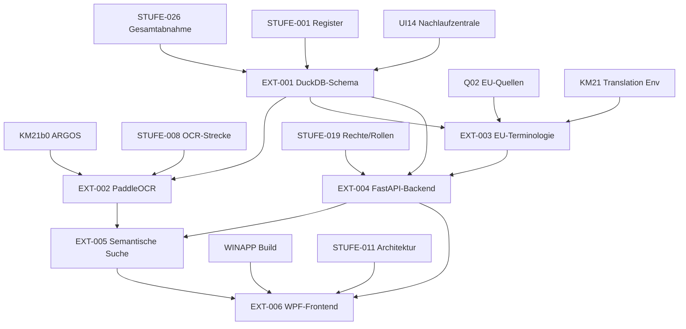

# ROADMAP-ERWEITERUNG-01 – Fachlicher Ausbau-Roadmap für ALIN

## Zusammenfassung

Die Grundpipeline von ALIN ist mit 89 von 90 Stufen abgeschlossen. Die letzte Stufe `DEPLOY` bleibt gesperrt, bis eine gesonderte Freigabe erfolgt. Dieses Dokument definiert die nächste Phase: den fachlichen Ausbau in sechs Erweiterungsstufen (`EXT-001` bis `EXT-006`). Alle Stufen bauen auf den abgeschlossenen Grundlagen auf, bleiben vollständig offline-fähig und verwenden ausschließlich lokale Open-Source-Komponenten.

## Voraussetzungen

Vor Beginn der Erweiterung müssen folgende Stufen der Roadmap v2 abgeschlossen sein:

- `STUFE-026` – Gesamtabnahme und Produktionsfreigabe (menschlich dokumentiert)
- `STUFE-001` – Register befüllt
- `STUFE-019` – Rechte und Rollen finalisiert
- `STUFE-011` – Windows-App-Architektur finalisiert
- `KM21b0` – ARGOS Modellbereitstellung
- `Q02` – Quellenkandidaten EU SE Official Sources
- `WINAPP` – Windows App Build und Release

## Übersicht der Erweiterungsstufen

| Stufe | Name | Phase | Priorität |
|-------|------|-------|-----------|
| EXT-001 | DuckDB-Schema für lokale Datenhaltung | Phase A: Datenfundament | 101 |
| EXT-002 | Verbesserte OCR mit PaddleOCR und Layout-Analyse | Phase B: OCR-Verbesserung | 102 |
| EXT-003 | EU-Terminologiepakete für Rechtssicherheit | Phase C: Rechtswissen | 103 |
| EXT-004 | FastAPI-Backend für lokale API | Phase D: API-Schicht | 104 |
| EXT-005 | Semantische Suche in Dokumenten | Phase E: KI-Suche | 105 |
| EXT-006 | WPF-Frontend für Windows-App | Phase F: UI-Neuaufbau | 106 |

## Abhängigkeitsgraph

---

## EXT-001: DuckDB-Schema für lokale Datenhaltung

### Beschreibung
Einführung von DuckDB als lokale, dateibasierte analytische Datenbank. Dies bildet das zentrale Datenfundament für alle nachfolgenden Erweiterungen. Es werden Schemas für Dokumente, OCR-Ergebnisse, Übersetzungen, Terminologie und Vektorembeddings definiert.

### Abhängigkeiten
- `STUFE-026` – Gesamtabnahme abgeschlossen
- `STUFE-001` – Register befüllt
- `UI14` – Ausführungs-Nachlaufzentrale abgeschlossen

### Eingaben
- `ALIN_Neustart_Core/01_Register/modulregister.json`
- `ALIN_Neustart_Core/01_Register/ressourcenregister.json`
- `ALIN_Neustart_Core/03_Schnittstellen/uebergabe_ocr_an_akte.schema.json`
- `Config/core21_arbeitsindex_v1.json`

### Ausgaben
- `Database/Migrations/100_duckdb_schema_ext001.sql`
- `Scripts/python_runner/ext001_duckdb_schema.py`
- `Scripts/python_runner/check_ext001_duckdb_schema.py`
- `Scripts/EXT001_DUCKDB_SCHEMA_AUTOLAUF.ps1`
- `Config/ext001_duckdb_schema_v1.json`
- `Projektplanung/EXT001_DUCKDB_SCHEMA.md`
- `ALIN_Neustart_Core/Reports/EXT001_DUCKDB_SCHEMA_BERICHT.txt`

### Sperren
- Kein Cloud-DB-Service (AWS RDS, Azure SQL, etc.)
- Keine echten Mandantendaten in der Entwicklung
- Keine Remote-Verbindungen
- Nur lokale `.duckdb`-Dateien im Projektverzeichnis
- Schema-Migration nur nach Backup

### Tests
- DuckDB-Schema validiert (alle Tabellen, Indizes, Constraints)
- Migration idempotent ausführbar
- Prüfdatei bestanden
- Python-Runner erfolgreich
- PowerShell-Starter funktioniert
- Lesender und schreibender Zugriff getestet
- Keine Datenlecks bei Testdaten

### Fertigstellungskriterien
- Migration angelegt und getestet
- Python-Läufer und Prüfdatei vorhanden
- PowerShell-Starter funktioniert
- Konfiguration unter Config abgelegt
- Dokumentation unter Projektplanung erstellt
- Bericht unter Reports geschrieben

---

## EXT-002: Verbesserte OCR mit PaddleOCR und Layout-Analyse

### Beschreibung
Erweiterung der bestehenden OCR-Strecke (`KM12`–`KM21`) um PaddleOCR zur Verbesserung der Erkennungsrate bei komplexen Layouts (Tabellen, Spalten, Fußnoten). Layout-Analyse ermöglicht die strukturierte Extraktion von Dokumentbereichen.

### Abhängigkeiten
- `EXT-001` – DuckDB-Schema vorhanden (Speicherung der OCR-Ergebnisse)
- `KM21b0` – ARGOS Modellbereitstellung abgeschlossen
- `STUFE-008` – OCR-Strecke angebunden

### Eingaben
- `Config/ocr_pipeline_v1.json`
- `Config/km17_sprachrouting_ocr_v1.json`
- `Config/eu_official_ocr_languages_v1.json`
- `Database/Migrations/100_duckdb_schema_ext001.sql`

### Ausgaben
- `Scripts/python_runner/ext002_paddleocr_layout.py`
- `Scripts/python_runner/check_ext002_paddleocr_layout.py`
- `Scripts/EXT002_PADDLEOCR_LAYOUT_AUTOLAUF.ps1`
- `Config/ext002_paddleocr_layout_v1.json`
- `Projektplanung/EXT002_PADDLEOCR_LAYOUT.md`
- `ALIN_Neustart_Core/Reports/EXT002_PADDLEOCR_LAYOUT_BERICHT.txt`

### Sperren
- Kein Cloud-OCR-Service (Google Vision, AWS Textract, Azure Form Recognizer)
- Keine Internetverbindung während der OCR-Verarbeitung
- Nur lokale PaddleOCR-Modelle aus dem Toolregister
- Keine echten Mandantendokumente für Training oder Test
- Nur Test-PDFs mit synthetischen oder frei lizenzierten Inhalten

### Tests
- PaddleOCR-Installation und Modell-Download offline-fähig
- Layout-Analyse erkennt Tabellen, Spalten und Fußnoten
- OCR-Ergebnisse werden in DuckDB gespeichert
- Prüfdatei bestanden
- Vergleich mit Tesseract-Baseline dokumentiert
- Python-Runner und PowerShell-Starter funktionieren

### Fertigstellungskriterien
- Python-Läufer und Prüfdatei vorhanden
- PowerShell-Starter funktioniert
- Konfiguration unter Config abgelegt
- Dokumentation unter Projektplanung erstellt
- Bericht unter Reports geschrieben
- Performance-Vergleich mit Tesseract dokumentiert

---

## EXT-003: EU-Terminologiepakete für Rechtssicherheit

### Beschreibung
Aufbau eines lokalen EU-Terminologie-Registers für rechtssichere Übersetzungen und Begriffsprüfungen. Enthält EuroVoc-Konzepte, EU-Verordnungsbegriffe und fachanwaltlich validierte Übersetzungsäquivalente.

### Abhängigkeiten
- `EXT-001` – DuckDB-Schema (Terminologie-Tabellen)
- `Q02` – Quellenkandidaten EU SE Official Sources
- `KM21` – Translation Environment

### Eingaben
- `Config/eu_official_ocr_languages_v1.json`
- `ALIN_Neustart_Core/01_Register/quellen_adapter_register.json`
- `ALIN_Neustart_Core/09_Toolbibliothek/01_Download_Quellen/ALIN_OFFIZIELLE_DOWNLOADQUELLEN.md`
- `Database/Migrations/100_duckdb_schema_ext001.sql`

### Ausgaben
- `Scripts/python_runner/ext003_eu_terminologie.py`
- `Scripts/python_runner/check_ext003_eu_terminologie.py`
- `Scripts/EXT003_EU_TERMINOLOGIE_AUTOLAUF.ps1`
- `Config/ext003_eu_terminologie_v1.json`
- `Projektplanung/EXT003_EU_TERMINOLOGIE.md`
- `ALIN_Neustart_Core/Reports/EXT003_EU_TERMINOLOGIE_BERICHT.txt`

### Sperren
- Kein Cloud-Übersetzungsdienst (DeepL API, Google Translate API, Azure Translator)
- Keine Online-Terminologie-Abfragen während des Betriebs
- EU-Daten nur aus lokalen, vorher heruntergeladenen Quellen
- Keine echten Mandantendaten für Begriffsvalidierung
- Lizenzprüfung aller EU-Daten erforderlich (offizielle EU-Lizenzen)

### Tests
- Terminologie-JSON validiert und vollständig
- DuckDB-Import aller Begriffe erfolgreich
- Abfrage nach Begriff und Sprachpaar funktioniert
- Lizenzregister-Eintrag für EU-Daten vorhanden
- Prüfdatei bestanden
- Offline-Operation bestätigt

### Fertigstellungskriterien
- Python-Läufer und Prüfdatei vorhanden
- PowerShell-Starter funktioniert
- Konfiguration unter Config abgelegt
- Dokumentation unter Projektplanung erstellt
- Bericht unter Reports geschrieben
- Lizenzkompliance für EU-Daten bestätigt

---

## EXT-004: FastAPI-Backend für lokale API

### Beschreibung
Lokales FastAPI-Backend als zentrale API-Schicht für ALIN. Bietet Endpunkte für Dokumentenverwaltung, OCR-Trigger, Übersetzungsanfragen, Terminologie-Abfragen und semantische Suche. Läuft ausschließlich auf `localhost` und kommuniziert mit der lokalen DuckDB.

### Abhängigkeiten
- `EXT-001` – DuckDB-Schema (Datenquelle)
- `EXT-003` – EU-Terminologiepakete (API-Endpunkt für Begriffsabfrage)
- `STUFE-019` – Rechte und Rollen (API-Autorisierung)

### Eingaben
- `ALIN_Neustart_Core/18_Rechte_Rollen/BERECHTIGUNGEN.schema.json`
- `Config/ext001_duckdb_schema_v1.json`
- `Config/ext003_eu_terminologie_v1.json`
- `ALIN_Neustart_Core/03_Schnittstellen/`

### Ausgaben
- `Scripts/python_runner/ext004_fastapi_backend.py`
- `Scripts/python_runner/check_ext004_fastapi_backend.py`
- `Scripts/EXT004_FASTAPI_BACKEND_AUTOLAUF.ps1`
- `Config/ext004_fastapi_backend_v1.json`
- `Projektplanung/EXT004_FASTAPI_BACKEND.md`
- `ALIN_Neustart_Core/Reports/EXT004_FASTAPI_BACKEND_BERICHT.txt`

### Sperren
- Kein externer API-Zugriff (keine offenen Ports, keine Reverse-Proxy-Öffnung)
- Nur `127.0.0.1` / `localhost` erlaubt
- Keine Authentifizierung gegen externe IdP (Azure AD, Okta)
- Lokale Autorisierung basierend auf `STUFE-019`
- Keine echten Mandantendaten über API-Endpunkte
- Kein HTTPS-Zwang im lokalen Entwicklungsmodus (nur HTTP auf localhost)

### Tests
- FastAPI-Server startet lokal erfolgreich
- Alle Endpunkte liefern erwartete Schemas
- DuckDB-Verbindung über API funktioniert
- Autorisierung für verschiedene Rollen getestet
- Prüfdatei bestanden
- Python-Runner und PowerShell-Starter funktionieren
- Keine ausgehenden Netzwerkverbindungen während des Betriebs

### Fertigstellungskriterien
- Python-Läufer und Prüfdatei vorhanden
- PowerShell-Starter funktioniert
- Konfiguration unter Config abgelegt
- Dokumentation unter Projektplanung erstellt
- API-Schema-Dokumentation vorhanden
- Bericht unter Reports geschrieben
- Netzwerk-Isolation bestätigt

---

## EXT-005: Semantische Suche in Dokumenten

### Beschreibung
Implementierung einer lokalen semantischen Suche über Dokumenteninhalte. Verwendet lokale Embedding-Modelle (z.B. `all-MiniLM-L6-v2` über `sentence-transformers`) und speichert Vektoren in DuckDB oder einer lokalen FAISS-Indizierung. Ermöglicht inhaltliche Suche über OCR-Texte und Übersetzungen.

### Abhängigkeiten
- `EXT-001` – DuckDB-Schema (Speicher der Embeddings)
- `EXT-002` – PaddleOCR (qualitativ hochwertige OCR-Texte als Embedding-Grundlage)
- `EXT-004` – FastAPI-Backend (API-Endpunkt für semantische Suche)

### Eingaben
- `Config/ext002_paddleocr_layout_v1.json`
- `Config/ext004_fastapi_backend_v1.json`
- `ALIN_Neustart_Core/01_Register/toolregister.json`
- `Database/Migrations/100_duckdb_schema_ext001.sql`

### Ausgaben
- `Scripts/python_runner/ext005_semantische_suche.py`
- `Scripts/python_runner/check_ext005_semantische_suche.py`
- `Scripts/EXT005_SEMANTISCHE_SUCHE_AUTOLAUF.ps1`
- `Config/ext005_semantische_suche_v1.json`
- `Projektplanung/EXT005_SEMANTISCHE_SUCHE.md`
- `ALIN_Neustart_Core/Reports/EXT005_SEMANTISCHE_SUCHE_BERICHT.txt`

### Sperren
- Kein Cloud-Embedding-Service (OpenAI API, Cohere, Azure OpenAI)
- Keine Vektor-Cloud-Datenbank (Pinecone, Weaviate Cloud, Qdrant Cloud)
- Nur lokale Modelle aus dem Toolregister
- Keine echten Mandantendokumente für Indexierung
- Embedding-Berechnung offline und lokal

### Tests
- Embedding-Modell lädt und arbeitet offline
- Vektorindizierung funktioniert lokal
- Semantische Abfrage liefert relevante Ergebnisse
- Integration über FastAPI-Endpunkt getestet
- Prüfdatei bestanden
- Python-Runner und PowerShell-Starter funktionieren
- Speicherbedarf dokumentiert

### Fertigstellungskriterien
- Python-Läufer und Prüfdatei vorhanden
- PowerShell-Starter funktioniert
- Konfiguration unter Config abgelegt
- Dokumentation unter Projektplanung erstellt
- Bericht unter Reports geschrieben
- Embedding-Performance und Speicherbedarf dokumentiert

---

## EXT-006: WPF-Frontend für Windows-App

### Beschreibung
Neuentwicklung des Windows-Frontends auf Basis von WPF (.NET 6/8). Ersetzt die bestehende WinUI-3-App. Bietet Dreiansicht, Posteingangsbearbeitung, OCR-Kontrolle, semantische Suche und Rechtswissen-Integration. Kommuniziert ausschließlich mit dem lokalen FastAPI-Backend.

### Abhängigkeiten
- `EXT-004` – FastAPI-Backend (Datenquelle und API)
- `EXT-005` – Semantische Suche (UI-Integration der Suchergebnisse)
- `WINAPP` – Windows App Build und Release (Archivierung der alten App)
- `STUFE-011` – Windows-App-Architektur finalisiert

### Eingaben
- `ALIN_Neustart_Core/08_Windows_App_Grundlage/ALIN_WINDOWS_APP_ARCHITEKTUR_V1.md`
- `ALIN_Neustart_Core/08_Windows_App_Grundlage/ALIN_WINDOWS_UI_GRUNDSAETZE_V1.md`
- `Config/ext004_fastapi_backend_v1.json`
- `Config/ext005_semantische_suche_v1.json`
- `Windows_App/App/KI_Legal_WindowsApp.csproj`

### Ausgaben
- `Windows_App_WPF/App/KI_Legal_WPF.csproj`
- `Windows_App_WPF/App/App.xaml`
- `Windows_App_WPF/App/MainWindow.xaml`
- `Windows_App_WPF/Scripts/Build_App.ps1`
- `Windows_App_WPF/Scripts/Start_App.ps1`
- `Config/ext006_wpf_frontend_v1.json`
- `Projektplanung/EXT006_WPF_FRONTEND.md`
- `ALIN_Neustart_Core/Reports/EXT006_WPF_FRONTEND_BERICHT.txt`
- `ALIN_Neustart_Core/08_Migration/08_Archiv_Vorschlag/WINAPP_ARCHIVIERUNG.json`

### Sperren
- Kein Deployment der WPF-App
- Keine Produktivfreigabe
- Alte WinUI-3-App muss vor Freigabe archiviert werden
- Keine echten Mandantendaten im UI-Test
- Keine externen UI-Bibliotheken ohne Lizenzprüfung
- App kommuniziert nur mit `localhost`

### Tests
- WPF-App kompiliert und startet lokal
- Dreiansicht funktioniert
- Posteingangsbearbeitung über FastAPI getestet
- Semantische Suche integriert und getestet
- Rechtswissen-Panel funktioniert
- Prüfdatei bestanden
- Build-Skript funktioniert
- Start-Skript funktioniert
- Alte App wurde archiviert

### Fertigstellungskriterien
- WPF-Projekt kompilierbar
- Build- und Start-Skripte vorhanden
- Konfiguration unter Config abgelegt
- Dokumentation unter Projektplanung erstellt
- Bericht unter Reports geschrieben
- Archivierung der alten WinUI-3-App dokumentiert
- Lizenzregister aktualisiert

---

## Globale Sperren für alle Erweiterungsstufen

| Sperre | Begründung |
|--------|------------|
| Kein Deployment | Keine MSIX-Paketierung, keine Installation auf Produktivsystemen |
| Keine Produktivfreigabe | Freigabe nur durch menschlichen Entscheid |
| Keine echten Mandantendaten | Datenschutz und Mandatsgeheimnis |
| Keine Cloud/Internet-Abhängigkeit | Vollständige Offline-Fähigkeit |
| Nur lokale Open-Source-Tools | Lizenzregister-Pflicht, keine kommerziellen SaaS |
| Stufen vollständig offline-fähig | Gerichtslaptop-Profil muss funktionieren |

## Phasen der Erweiterung

1. **Phase A: Datenfundament** – EXT-001
2. **Phase B: OCR-Verbesserung** – EXT-002
3. **Phase C: Rechtswissen** – EXT-003
4. **Phase D: API-Schicht** – EXT-004
5. **Phase E: KI-Suche** – EXT-005
6. **Phase F: UI-Neuaufbau** – EXT-006

## Lieferpflichten je Stufe

Jede Stufe liefert gemäß `AGENTS.md`:

1. Migration, falls Datenbank betroffen ist.
2. Python-Läufer unter `Scripts/python_runner`.
3. Prüfdatei unter `Scripts/python_runner`.
4. PowerShell-Starter unter `Scripts`.
5. Konfiguration unter `Config`, falls erforderlich.
6. Dokumentation unter `Projektplanung`.
7. Testlauf.
8. Bericht unter `ALIN_Neustart_Core/Reports`.
9. Git-Status vor und nach Änderung.
10. Git-Commit nur bei erfolgreichem Build und erfolgreicher Prüfung.

## Gültigkeit und Version

- **Dokumentversion:** 1.0.0
- **Erstellt:** 2026-05-18
- **Gültig ab:** Abschluss von `STUFE-026`
- **Nächste Review:** Nach Abschluss von `EXT-006`
- **Eigentümer:** ALIN Architektur-Team
